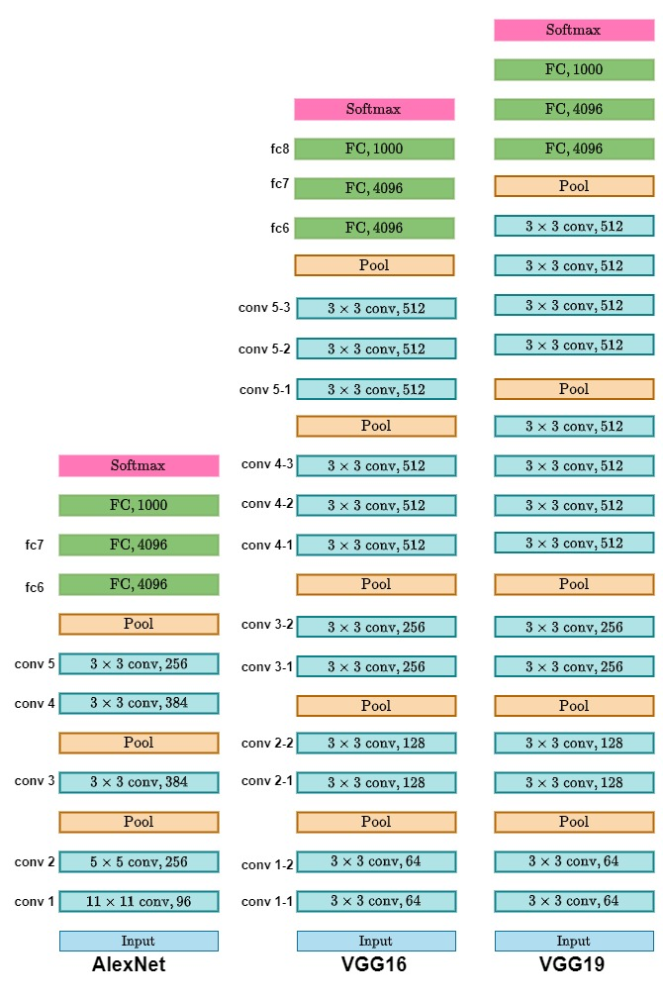

*Image: ImageNet Challenge, 2010-2017, CS231n.* 
### What's in here:

* [1. Introduction](#1)
* [2. VGG Architecture](#2)
* [3. VGG Implementation](#3)
* [4. Final Notes](#4)
<a name='1'></a>
## 1. Introduction
VGG16, developed by the Visual Geometry Group at the University of Oxford, is an influential architecture in the field of deep learning. It comprises 16 layers with learnable parameters (hence the name), primarily using 3x3 convolutional filters, followed by max pooling layers. This architecture has shown impressive performance in various image classification benchmarks.

The VGG network won in the 2014 ImageNet competition for classification and localization tasks. VGG established new ideas for the design of ConvNets, many of which remain standard today, and it possessed greater depth than AlexNet. This pattern demonstrated that deep networks consistently outperform shallow networks.

<a name='2'></a>

## 2. VGG Architecture
The VGG architecture comprises 16 layers (VGG-16) and 19 layers (VGG-19). This quantity is double the number of layers in AlexNet.

The key design tenets of the VGG network are outlined below: 

Each convolutional layer employs a kernel size of 3x3 and utilizes zero padding to ensure that the output maintains the same height and width as the input. The stride is configured to one.
* Convolutional layers are arranged in stages, with each level succeeded by a pooling layer.
* All convolutional layers employ the ReLU activation function.
* All max pooling layers utilize a pooling size of 2 and a stride of 2.
* Subsequent to the pooling layer, the ensuing convolutional step featured double the amount of filters compared to the preceding stages. If the initial convolutional layer comprises 64 filters, the subsequent layer will consist of 128 filters. This design concept is still extensively utilized today in the development of convolutional neural networks. The initial convolutional stage comprises 64 filters, the second stage contains 128 filters, the fourth stage includes 256 filters, and the fifth stage consists of 512 filters. 

The convolutional layers in VGG-16 are structured as follows:    

* Stage 1: conv - conv - pool
* Stage 2: conv - conv - pool
* Stage 3: conv - conv - conv - pool
* Stage 4: conv - conv - conv - pool
* Stage 5: conv - conv - conv - pool

In VGG-19, the 4th and 5th stages have 4 convolutional layers. 

Same as AlexNet, VGG has also 3 fully connected layers with exact same configurations: 4096 units in first two fully connected layers, 
and 1000 units in last connected layers. The last layer has a softmax activation function for classification purpose.
*Image: AlexNet and VGG-16 & VGG-19 architectures. Image captured from CS231n.*


Justin Johnson has also a great side by side comparison of AlexNet and VGG in his Deep Learning for Computer Vision course.
<a name='3'></a>

## 3. VGG Implementation
As we now understand the ins and out of the VGG network, let's implement it. There are many versions of VGG such as VGG-11, VGG-16, VGG-19. We will implement VGG-16 but
the process is similar to how you would implement other versions. 

A quickiest way to implement VGG is to just stack all layers with their respective hyperparameters, block after a block. A fancier and clean way would be to build a
convolutional block as a function that takes number of convolutional layers and filters and reuse
it for each block.

### The CIFAR-10 Dataset
The CIFAR-10 dataset consists of 60,000 32x32 color images across 10 classes: airplane, automobile, bird, cat, deer, dog, frog, horse, ship, and truck. While VGG16 is often used with larger datasets like ImageNet, we can adapt it for CIFAR-10 by resizing the images.


### Setting Up the Environment
Before we start, make sure you have PyTorch and torchvision installed. If you haven't done so yet, you can install them using:
```
pip install torch torchvision
```

### Step 1: Import Necessary Libraries
First, we need to import the required libraries, including PyTorch and torchvision:
```python
import torch
import torchvision
import torch.nn as nn
import torch.optim as optim
from torch.utils.data import DataLoader
import torchvision.transforms as transforms
```


### Step 2: Define the VGG16 Model
Next, we define the VGG16 model. This model contains several convolutional layers followed by fully connected layers:
```python
class VGG16(nn.Module):
    def __init__(self, num_classes=1000):
        super(VGG16, self).__init__()
        # Define convolutional blocks (features)
        self.features = nn.Sequential(
            # Block 1
            nn.Conv2d(3, 64, kernel_size=3, padding=1),
            nn.ReLU(inplace=True),
            nn.Conv2d(64, 64, kernel_size=3, padding=1),
            nn.ReLU(inplace=True),
            nn.MaxPool2d(kernel_size=2, stride=2),

            # Block 2
            nn.Conv2d(64, 128, kernel_size=3, padding=1),
            nn.ReLU(inplace=True),
            nn.Conv2d(128, 128, kernel_size=3, padding=1),
            nn.ReLU(inplace=True),
            nn.MaxPool2d(kernel_size=2, stride=2),

            # Block 3
            nn.Conv2d(128, 256, kernel_size=3, padding=1),
            nn.ReLU(inplace=True),
            nn.Conv2d(256, 256, kernel_size=3, padding=1),
            nn.ReLU(inplace=True),
            nn.Conv2d(256, 256, kernel_size=3, padding=1),
            nn.ReLU(inplace=True),
            nn.MaxPool2d(kernel_size=2, stride=2),

            # Block 4
            nn.Conv2d(256, 512, kernel_size=3, padding=1),
            nn.ReLU(inplace=True),
            nn.Conv2d(512, 512, kernel_size=3, padding=1),
            nn.ReLU(inplace=True),
            nn.Conv2d(512, 512, kernel_size=3, padding=1),
            nn.ReLU(inplace=True),
            nn.MaxPool2d(kernel_size=2, stride=2),

            # Block 5
            nn.Conv2d(512, 512, kernel_size=3, padding=1),
            nn.ReLU(inplace=True),
            nn.Conv2d(512, 512, kernel_size=3, padding=1),
            nn.ReLU(inplace=True),
            nn.Conv2d(512, 512, kernel_size=3, padding=1),
            nn.ReLU(inplace=True),
            nn.MaxPool2d(kernel_size=2, stride=2)
        )

        # Fully connected layers (classifier)
        self.classifier = nn.Sequential(
            nn.Flatten(),
            nn.Linear(512 * 7 * 7, 4096),
            nn.ReLU(inplace=True),
            nn.Dropout(0.5),
            nn.Linear(4096, 4096),
            nn.ReLU(inplace=True),
            nn.Dropout(0.5),
            nn.Linear(4096, num_classes),
            nn.Softmax(dim=1)
        )

    def forward(self, x):
        x = self.features(x)
        x = self.classifier(x)
        return x

if __name__ == "__main__":
  vgg_16 = VGG16(num_classes=1000)

  # Create a random input tensor with shape (batch_size, channels, height, width)
  # For example, batch size = 1, channels = 3 (RGB), height = 224, width = 224
  input_tensor = torch.rand(1, 3, 224, 224) # random imput tensor
  output = vgg_16(input_tensor)
  print("Output shape:", output.shape) # print the shape
```
```
Output shape: torch.Size([1, 1000])
```

#### Step 3: Load and Preprocess the Dataset
Now, we need to load the CIFAR-10 dataset and apply necessary transformations. We'll resize the images to 224x224 (the input size for VGG16) and normalize them:

```python
def load_cifar10_dataset(batch_size=32):
    # Define data transformations
    transform = transforms.Compose([
        transforms.Resize((224, 224)),  # Resize images to 224x224
        transforms.ToTensor(),  # Convert images to tensors
        transforms.Normalize(mean=[0.485, 0.456, 0.406], std=[0.229, 0.224, 0.225])  # Normalize
    ])

    # Load CIFAR-10 dataset
    train_dataset = torchvision.datasets.CIFAR10(root='./data', train=True, transform=transform, download=True)
    test_dataset = torchvision.datasets.CIFAR10(root='./data', train=False, transform=transform, download=True)

    train_loader = DataLoader(dataset=train_dataset, batch_size=batch_size, shuffle=True)
    test_loader = DataLoader(dataset=test_dataset, batch_size=batch_size, shuffle=False)

    return train_loader, test_loader
```

### Step 4: Define the Loss Function and Optimizer
Next, we need to set up our loss function and optimizer. We will use the CrossEntropyLoss for multi-class classification and the Adam optimizer:
The VGG-16 network, trained on the ImageNet dataset, contains about 138 million parameters. The network is quite extensive.

```python
vgg_16 = VGG16(num_classes=10)  # Change num_classes to 10 for CIFAR-10

train_loader, test_loader = load_cifar10_dataset(batch_size=32)

# Define loss function and optimizer
criterion = nn.CrossEntropyLoss()
optimizer = optim.Adam(vgg_16.parameters(), lr=learning_rate)
```
### Step 5: Train the Model
We will now implement the training loop. For each epoch, we’ll perform a forward pass, compute the loss, backpropagate the gradients, and update the weights:
```python
# Training the model
for epoch in range(num_epochs):
    for images, labels in train_loader:
        # Forward pass
        outputs = vgg_16(images)
        loss = criterion(outputs, labels)

        # Backward pass and optimization
        optimizer.zero_grad()  # Zero the gradients
        loss.backward()  # Backpropagate
        optimizer.step()  # Update weights

    print(f'Epoch [{epoch + 1}/{num_epochs}], Loss: {loss.item():.4f}')
```
### Step 6: Evaluate the Model
After training, we need to evaluate the model's performance on the test set. We will calculate the accuracy:

```python
# Testing the model
vgg_16.eval()  # Set the model to evaluation mode
with torch.no_grad():
    correct = 0
    total = 0
    for images, labels in test_loader:
        outputs = vgg_16(images)
        _, predicted = torch.max(outputs.data, 1)
        total += labels.size(0)
        correct += (predicted == labels).sum().item()

    print(f'Accuracy of the model on the test images: {100 * correct / total:.2f}%')

```
<a name="4"></a>

## 4. Concluding Remarks
The VGG network is among the pioneering architectures of ConvNets that established architectural principles for visual recognition systems; yet, it possesses a substantial number of parameters, rendering it computationally inefficient. The subsequent architectures we shall examine, including GoogLeNet, tackled the difficulty of creating efficient designs suitable for mobile devices.

We successfully trained and tested a VGG16 model on the CIFAR-10 dataset. We covered all the necessary steps, from defining the model to evaluating its performance. While the VGG16 architecture is relatively simple, its depth allows it to learn complex features from images, making it a powerful tool for image classification tasks.

Feel free to modify the hyperparameters or explore different datasets to further your understanding of deep learning with PyTorch. Happy coding!


